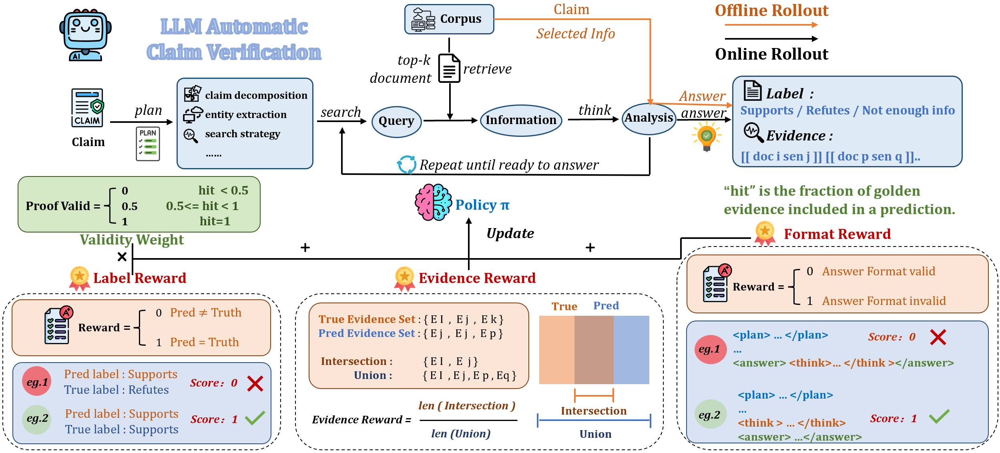

# Veri-R1: Toward Autonomous and Faithful Claim Verification via Online Reinforcement Learning



**Veri-R1** is designed to enhance large language models’ comprehensive verification capabilities—including planning, searching, reasoning, and judgment—through online reinforcement learning.

To achieve this, we propose a fine-grained reward system that ensures the **faithfulness, correctness, and precision** of verification trajectories, building upon the frameworks of [Search-R1](https://github.com/PeterGriffinJin/Search-R1) and [veRL](https://github.com/volcengine/verl).

[**🤗Model and Dataset**](https://huggingface.co/collections/H0key/veri-r1-68bc1ccf4795f9294a8b4707)

[**📖Paper**]()

## Installation

### Verification Environment

```
conda create -n verir1 python=3.9
conda activate verir1
# vllm
pip3 install vllm==0.6.3 # it will install torch and other necessary packages

# verl
pip install -e .

# flash attention 2
pip3 install flash-attn --no-build-isolation
pip install wandb
```

We encountered a `Runtime error: batch size must be positive`, which is caused by a mismatch between the **Verl framework** and **Transformers**.

To fix this issue, we refined the Transformer implementation to ensure stability and prevent unexpected random break-offs.

```
unzip transformers.zip
cd transformers
pip install -e.
```

### Retriever Environment

```
conda create -n retriever python=3.10
conda activate retriever

# install pytorch
conda install pytorch==2.4.0 torchvision==0.19.0 torchaudio==2.4.0 pytorch-cuda=12.1 -c pytorch -c nvidia
pip install transformers datasets pyserini

## install faiss
conda install -c pytorch -c nvidia faiss-gpu=1.8.0

## install api function
pip install uvicorn fastapi
```

## Corpus

The corpus must follow the structure`{"id": "", "title": "", "text": ""}`

We introduce [SEP] to benefit sentence-level segmentaiton

### Examples

```
{"id": "Kansas State Wildcats football<sent_id=57_59>", "title": "Kansas State Wildcats football", "text": "\"Kansas State Wildcats football\"\nIn seven seasons at Kansas State, Coach Doug Weaver compiled an 8–60–1 record. [SEP] His final two seasons went without a win. [SEP] His 1961 and 1962 teams posted a losing streak of 18 games—tied for the 20th-longest streak in college football history."}
```

To improve retrieval precision and avoid overly long contexts, we split each article into individual sentences and then group every *k* consecutive sentences as one entity. The special token `[SEP]` is introduced as a separator between sentences, enabling sentence-level segmentation.

Because evidence IDs are tracked at the sentence level, the retrieved sentences are merged into the context together with the available search turns. The merged context is wrapped between `<information></information>` tags, following this format:

```
<information>
[[Berkheya_sentence_0]]: Berkheya is a genus of flowering plants in the aster family, Asteraceae, and the subfamily Carduoideae, the thistles.
[[Berkheya_sentence_1]]: It is distributed in tropical Africa, especially in southern regions.
[[Berkheya_sentence_2]]: Of about 75 species, 71 can be found in South Africa.
**2 search turns left.**
</information>
```

### Index Corpus

```
cd seach_engine/search
# change path to your own corpus
sh build_index.sh
```

### Start Local Search Engine

```
# change the path to your own corpus and index 
sh retrieval_launch.sh
```

## Training

### Online RL

```
sh online_grpo.sh
```

### Offline RL

```
sh offline_grpo.sh
```

### Superviesd Finetuning(SFT)

We use **[LLaMA Factory](https://github.com/hiyouga/LLaMA-Factory)** for the fine-tuning process.
 The supervised fine-tuning (SFT) data is located at:`example/train/train_sft.json`

## Evaluation

### Local Model Evaluation

We support both **batch evaluation** and **single model evaluation**.

- **Batch Model Evaluation**

  ```
  sh eva_batch.sh
  ```

  Edit the model list in the script to include your own models.

- **Single Model Evaluation**

  ```
  sh eva_single.sh
  ```

### API-based Evaluation

To evaluate closed-source models, we provide an API-driven evaluation pipeline.

Run:

```
sh run_api_eval.sh
```

You can configure the target model, number of workers, and batch size.

### Prepared Results

We also support direct evaluation with generated answers.

Run:

```
sh run_result_eval.sh
```

Each entry in the JSONL file should include the following fields:

```
{"id": ..., "claim": ..., "ground_truth": ..., "response": ..., "data_source": ...}
```

**Example**

```
{
"id": "117656", 
"claim": "Carlos Santana was born in the 20th century.", 
"ground_truth": {"evidence": ["Carlos_Santana_sentence_0"], "label": "SUPPORTS"}, 
"response": "\n<plan>\nI will first search ... <answer>\nLabel: SUPPORT\nEvidence: [[Carlos_Santana_sentence_0]]\n</answer>", 
"data_source": "fever"
 }
```

## Inference

(1) Launch a local retrieval server.

```bash
conda activate retriever
sh retrieval_launch.sh
```

(2) Inference.

```bash
conda activate verir1
python infer.py
```

You can modify the claim on line 7 to something you're interested in.

## Citation